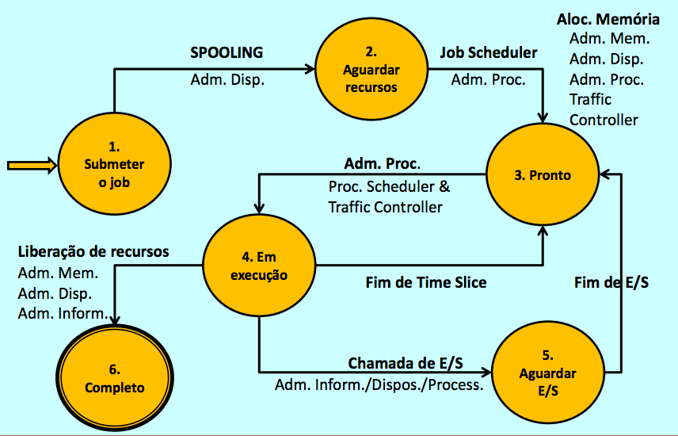
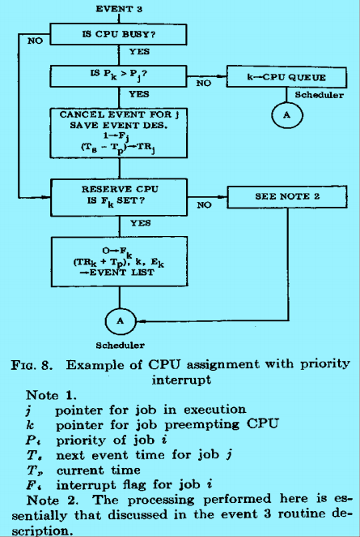

# PROJETO PCS2453 - 2016
## Simulador Estocástico de Processamento Multiprogramado, Dirigido por Eventos

## Primeira Parte

### Entradas do Simulador
* Instante inicial de acionamento do relógio de tempo real
* Instante final da simulação
* Instante de chegada de cada um dos elementos de um conjunto de programas independentes, para cada qual:
  * O tempo total estimado de processamento
  * Quantidade estimada de memória de que necessitará
  * Número estimado de operações de entrada/saída que deverá realizar

### Saídas Esperadas
* Imprimir um log de simulação na forma de uma lista, classificando todos os instantes previstos e executados, para todos os eventos que ocorrem na simulação.
* Impressão deve seguir a seguinte formatação:
  * <b>instante</b> é o valor corrente do relógio do Simulador
  * <b>tipo de evento</b> indica qual foi a ocorrência observada nesse instante da simulação
  * <b>identificação do programa</b> indica qual dos programas simulados provocou o evento
  * <b>ação executada</b> indica qual rotina foi executada como reação do sistema à ocorrencia do evento
  * <b>resultado</b> indica os efeitos dessa reação sobre a situação corrente do programa simulado

### Configuração à Simulador
* Memória principal (segmentada)
* Processador
* Disco com sistema de arquivos simples
* Duas leitoras físicas
* Duas impressoras físicas

### Modelo de Estados

### Eventos e seu Tratamento
* Eventos simulam interrupções na máquina
* Para cada tipo de interrupção deve haver uma rotina de tratamento
* O instante da ocorrência das interrupções deve ser programada no simulador

### Estrutura da Fila
* Header
  * ptr - Apontador para o tipo da lista
  * Wmax - Tempo máximo de espera
  * SomatorioTw - Tempo de espera acumulado
  * Qmax - Máximo tamanho da fila
  * Q - Tamanho atual da fila
  * SomatorioTq - tamanho * tempo acumulado
  * Tlast - Instante da ultima entrada/saída
  * N - Contador de entrada
* Elemento da Fila
  * J - Ponteiro de entrada da tabela de jobs
  * Pr - Prioridade
  * Tin - Momento da entrada na fila

### Filas a serem utilizadas
* Cada estado representa um recurso, com uma fila de espera associada
* Esses processos precisam ser organizados por instante de chegada e prioridade

### Alocação do Processador

## Segunda Parte

### Gerenciador de Memória: Memória Virtual Segmentada, Sem Paginação
* Cada recurso do sistema deve ter sua fila de espera
  * Memória
  * Multiprogramação (com limite pré-fixado de programas simultaneamente ativos no sistema)
  * CPU (lista de processos prontos para serem executados)
  * Entrada e Saída: Uma fila para cada dispositivo e serviço
  * Disco: Uma fila única para o disco físico
  * Arquivos: Diversas filas, cada uma para controlar o acesso a um arquivo especifico em uso

### Descrição do Job
* Instante de chegada
* Estrutura do Job (árvore dos segmentos que o constituem e tamanho de cada segmento)
* Número total previsto de entradas, saídas e acessos a arquivos
* Identificação dos arquivos a serem acessados pelo job
* Tempo máximo de CPU

### Gerenciador de Processos
* Multiprogramação por time-slice
* Grau limitado ajustável pelo sistema de multiprogramação
* Fila cíclica de processos prontos para execução da CPU
* Fila de CPU em regime cíclico (round robin)

### Gerenciador de Informações
* Sistema simples de arquivos linear único, visível por todos os programas do sistema
* Um esquema de proteção de acesso aos arquivos:
  * Identificação do programa proprietário do arquivo
  * Nome e tamanho do arquivo
  * Arquivos públicos de acesso geral, e particulares, acessíveis apenas ao proprietário

### Premissas
* Durante a execução do programa é igualmente provável que um segmento referencie qualquer dos segmentos que depende
* Intervalo entre dois pedidos sucessivos de entrada/saida pode ser inicialmente constante e estimado através do número de entradas/saidas prevista para o job
* Depois de testada com intervalos constantes, quando da chegada do job ao sistema, o tratamento deste evento passa a estabelecer, aleatoriamente, com distribuição uniforme, os instantes relativos dos pedidos de entrada/saida ao sistema
* O instante de ocorrencia de referências aos segmentos de memória podem ser estimados determinando-se, no momento do recebimento da CPU, se no time-slice corrente haverá ou não referência a algum outro segmento
* É possível tratar as referências à memória de forma análoga à das entradas/saídas.

### Referência de Segmento
* Se estiver sendo executado um segmento Si que tem como segmentos possivelmente referenciados Sk...Sm, ao receber a CPU, o processamento possível será:
  * Processamento interno em Si apenas, durante todo time-slice. Neste caso, apenas controlar o transcurso do tempo de processamento do job.
  * Referência a alguns do Sk...Sm antes do término do time-slice. Neste caso, contabilizar a parcela já transcorrida do time-slice, e iniciar a execução do segmento referenciado
    * Caso esteja presente na memória, o programa não perde a CPU, mas prossegue no segmento referenciado, caso contrário, inclui-se, no início da lista de eventos, no momento corrente de simulação, um evento de referência a um segmento que não está presente na memória – correspondente a uma interrupção de falta de segmento.

### Sobre Memória Segmentada
* A modelagem da memória segmentada pode ser feita nos mesmos moldes da memória particionada, com partições de tamanho arbitrário (as partições dos programas devem ter suas dimensões estabelecidas no momento da chegada do job, extraídas da descrição de sua estrutura).
* Não é obrigatório compactar a memória
* Em caso de fragmentação, bloquear o aumento do número de processos ativos até que seja liberada memória suficiente
* No entanto, se isso for considerado conveniente, há liberdade para incluir uma rotina de Garbage Collection

### Sobre o Sistema de Arquivos
* A modelagem do sistema de arquivos poderá ser feita aplicando-se à área em disco os mesmos algoritmos aplicados às partições de memória (uma partição de disco para cada arquivo, e em caso de fragmentação do disco, este é considerado saturado, a menos que seja adicionada opcionalmente uma rotina de compactação).

### Simulador final
* <b>Tabela de Jobs</b>
  * Quanto tempo de processamento falta para o programa terminar
  * Lista dos pontos no processamento em que há requisições de entrada/saída
  * Ponteiro para a árvore de segmentos que descreve a estrutura do programa, bem como as dimensões dos seus segmentos
  * Conjunto de arquivos a serem referenciados pelo programa, e suas dimensões no disco.
* <b>Tabelas de partições livres da memória física e de partições livres do disco</b>, com posição e comprimento.
* <b>Tabela de partições ocupadas da memória</b> (uma para cada programa), correspondente à segment map table do programa – tabela cujo conteúdo varia durante o processamento, em função de quais segmentos estão presentes na memória física
* <b>Tabela de partições ocupadas no disco</b> (única), correspondente ao conjunto de arquivos que formam o sistema de arquivos implementado. Cada linha desta tabela indica o nome, o possuidor, o tamanho e as características do arquivo a que se refere.
* <b>Eventos independentes</b>: chegada dos jobs
  * Identificação, instante de chegada, recursos utilizados: tempo de CPU, número de operações de entrada/saída, quantidade de memória ocupada pelos diversos segmentos.

## Complementação

### Sequência de Procedimentos do Job
1) Job chega no sistema

2) Espaço da memória principal é requisitada para o job. Se há espaço disponível é alocado para o job. Se não há espaço disponível o job entra em uma fila.

3) O processador central é requerido. Se estiver livre o job é executado até achar uma operação de IO ou a execução estive completa. Se o processador estiver ocupado, o job é colocado na fila.

4) Quando um job requer um IO, ele sai do processador e vai para o dispositivo IO. Se o dispositivo estiver livre, começa a realizar o procedimento, se não vai para a fila.

5) Quando o job termina o IO o disco é liberado e o processador é requisitado novamente 

6) Quando o job termina sua execução, o processador é liberado e o espaço que ele ocupava na memória também é liberado

7) O job sai do sistema

### Estrutura do Simulador
1) O Scheduler pega o evento do topo da lista de eventos. Esta entrada especifica um event time T, um event identifier E e um ponteiro para um job J.

2) O Scheduler avança o clock para o event time T especificado no primeiro passo. Pois este é o tempo do primeiro evento que irá ocorrer no sistema.

3) O Scheduler transfere o controle para a rotina do evento especificado

4) A rotina realiza todos os procedimentos necessários para o job, determina o próximo evento, event time e o job e adiciona à list de eventos. Depois retorna o controle para o Scheduler.

### Segmentação Simples
* Divide-se o programa em segmentos
* Aloca-se uma partição para cada segmento
* Monta-se uma tabela de mapeamento de segmentos, indicando a posição de cada um na memória física
* Trata-se cada segmento como se fosse uma partição relocável, usando como base o endereço de alocação
* Determina-se dinamicamente a base para utilizar para a relocação, para cada referência à memória

### Mapeamento de Endereços em Memória Segmentada
* Programa referencia um endereço lógico bidimensional (Segmento, Endereço Interno)